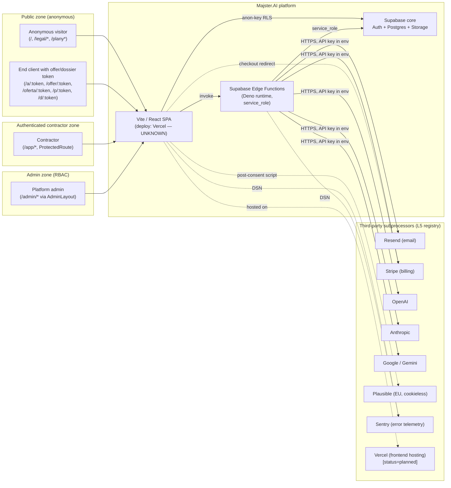
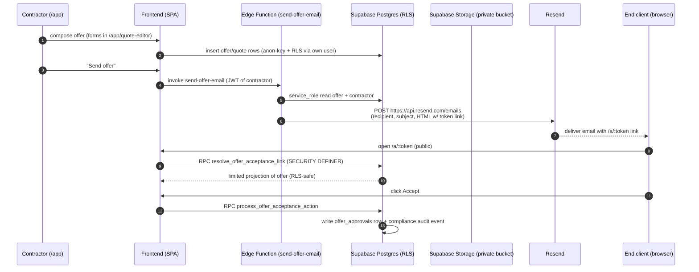
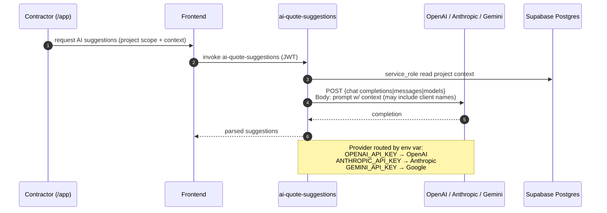
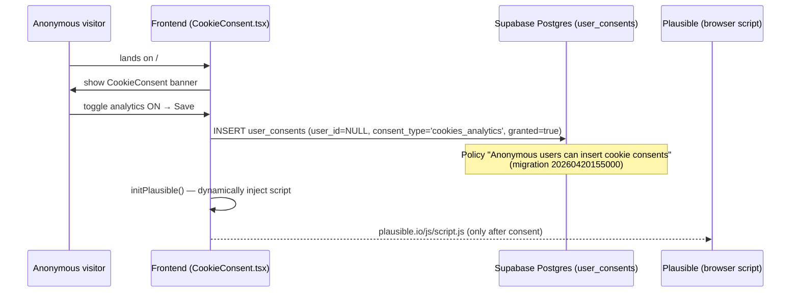

# PR-L9 — Data Flow Map (Majster.AI)

**Status:** Accepted — source-of-truth privacy/data-flow map
**PR:** PR-L9 (documentation + architecture truth only; no runtime changes)
**Branch:** `claude/pr-l9-data-flow-adr-Lnv46`
**Date:** 2026-04-21
**Related ADR:** `docs/ADR/ADR-0015-data-flow-and-trust-boundaries.md`
**Truth rule:** Only flows evidenced by files in this repository, currently published legal docs,
or other repo-side architecture docs are mapped. Anything not provable from repo is marked
**UNKNOWN** explicitly.

---

## 1. Executive Summary

- **Scope of this document:** map how personal data and business data enter, move, and
  leave Majster.AI, based strictly on repo evidence.
- **Core platform:** single Supabase project (Postgres + Auth + Storage + Edge Functions),
  Vite/React SPA deployed on Vercel (frontend deploy status: `UNKNOWN` — see
  `docs/DEPLOYMENT_TRUTH.md:9-12`).
- **Trust zones (confirmed in `src/App.tsx:232-394`):** public (anon), authenticated
  customer app (`/app/*` behind `ProtectedRoute`), admin zone (`/admin/*`), Supabase
  server-side, Edge Functions (Deno), third-party processors.
- **Controllership, confirmed:** Majster.AI is **controller** for contractor account
  identity, company profile, billing metadata, and compliance logs. Majster.AI acts as
  **processor** for client/project/offer data that contractors upload about their own
  end-clients — DPA section 1 in `src/i18n/locales/pl.json` (`legal.dpa.s1content`).
- **Subprocessors — repo-confirmed active (source of truth: `public.subprocessors` table,
  migration `supabase/migrations/20260420200000_pr_l5_subprocessors_registry.sql`):**
  Supabase, Resend, Sentry, Stripe, OpenAI, Anthropic, Google (Gemini), Plausible.
- **Subprocessor — planned / unconfirmed:** Vercel (`status='planned'` in L5 registry;
  processor role under Art. 28 RODO not confirmed in repo).
- **Personal data enters through:** Supabase Auth sign-up/sign-in, `/register`, CSR
  forms inside `/app/*` (clients, projects, offers), public offer-acceptance flow
  (`/a/:token`, `/offer/:token`, `/oferta/:token`), public dossier (`/d/:token`),
  cookie-consent banner (anon insert into `user_consents`), DSAR form (`GDPRCenter.tsx`),
  voice-note and photo uploads (Edge Functions).
- **Outbound flows to third parties (evidenced in `supabase/functions/**`):** Resend
  (transactional email via `api.resend.com/emails`), Stripe (checkout + webhooks),
  OpenAI/Anthropic/Gemini (AI prompts — routing by env var in
  `supabase/functions/_shared/ai-provider.ts:56-60`), Plausible (post-consent browser
  script from `src/components/legal/CookieConsent.tsx:29`), Sentry (runtime errors, both
  frontend `src/lib/sentry.ts` and edge `supabase/functions/_shared/sentry.ts`).
- **Compliance plumbing now in place (L1–L8):** versioned `legal_documents` +
  `legal_acceptances` (PR-L1/L2), append-only `compliance_audit_log` (PR-L8),
  `dsar_requests` inbox (PR-L3), `subprocessors` registry (PR-L5), deployment-truth
  hardening (PR-L3b).
- **Honest gaps (detail in §8):** retention per data category is **UNKNOWN** (PR-L6
  owes it), breach register does not yet exist (PR-L7 owes it), transfer basis for
  several subprocessors is `UNKNOWN/NULL` in the L5 seed, and frontend-hosting role of
  Vercel is unresolved.
- **Risk posture:** the repo now has enough versioned evidence to answer who, what,
  where, and under which version — but **not yet** for how long or in which breach
  scenario. L9 does not attempt to close those gaps; it marks them.

---

## 2. System Context

### 2.1 What Majster.AI does

Construction/renovation SaaS for Polish contractors. Core domains (evidenced by
`src/components/` subdirectories and `src/pages/`):

- Client & project management (`src/pages/Clients.tsx`, `src/pages/ProjectsList.tsx`,
  `src/components/clients/`, `src/components/offers/`)
- AI-assisted quote/offer generation (`supabase/functions/ai-quote-suggestions/`,
  `supabase/functions/ai-chat-agent/`, `supabase/functions/voice-quote-processor/`,
  `supabase/functions/analyze-photo/`, `supabase/functions/ocr-invoice/`)
- PDF document generation (`supabase/functions/generate-offer-pdf/`,
  `supabase/functions/generate-pdf-v2/`)
- Billing (`supabase/functions/create-checkout-session/`,
  `supabase/functions/stripe-webhook/`, `supabase/functions/customer-portal/`)
- Email notifications (`supabase/functions/send-offer-email/`,
  `supabase/functions/send-calendar-reminders/`,
  `supabase/functions/send-expiring-offer-reminders/`,
  `supabase/functions/verify-contact-email/`)
- Photo/media library (`src/pages/Photos.tsx`, buckets `project-photos` and
  `company-documents`, migrations `20251205230527_*`, `20251206073947_*`)
- Compliance center (`src/pages/legal/*.tsx`, migrations L1/L2/L3/L5/L8)

### 2.2 Actors

| Actor | Identified by | Evidence |
|---|---|---|
| **Owner / platform admin** | `user_roles.role = 'admin'` | `supabase/migrations/20251206221151_*.sql` (`user_roles` table), `supabase/migrations/20260416120000_fix_user_roles_schema_rls.sql`, `docs/ADR/ADR-0012-admin-rbac-route-split.md`, `src/pages/admin/*` |
| **Authenticated user / contractor** | Supabase Auth session | `src/contexts/AuthContext.tsx`, `src/components/auth/ProtectedRoute.tsx`, all `/app/*` routes in `src/App.tsx:305-375` |
| **End client / offer recipient** | Token in URL (`acceptance_links.token` or `offer_approvals.public_token`) | `src/App.tsx:249-274`, `supabase/migrations/20260419130000_arch05_l6_accept_token.sql`, `supabase/migrations/20260413120000_sec01_harden_offer_approvals_anon_access.sql`, `supabase/functions/approve-offer/`, `supabase/functions/client-question/` |
| **Anonymous visitor** | No session | `src/App.tsx:236-298` (Zone 1 public routes), `supabase/migrations/20260420155000_pr_compliance_01_anon_consent.sql` (cookie consent INSERT for `anon`) |
| **Supabase (service_role server-side)** | Service role key | `supabase/functions/**/index.ts` — every function that uses `Deno.env.get('SUPABASE_SERVICE_ROLE_KEY')` |
| **Third-party subprocessors** | API tokens (env vars in Edge Function runtime) | L5 registry: `supabase/migrations/20260420200000_pr_l5_subprocessors_registry.sql` |

---

## 3. Roles Matrix (Controller vs Processor)

| Area | Role of Majster.AI | Counterparty role | Evidence | Notes |
|---|---|---|---|---|
| Account / auth data (contractor) | **Controller** | Supabase = processor | `src/integrations/supabase/client.ts:3-7`, DPA s1 in `src/i18n/locales/pl.json` (`legal.dpa.s1content`) | Email, password hash, user_id held in `auth.users`. |
| Company profile (contractor) | **Controller** | Supabase = processor | `src/pages/CompanyProfile.tsx`, migration `20260403140000_add_legal_form_fields.sql`, bucket `logos` (migration `20251205164727_*.sql:69-71`) | Company name, NIP, REGON, legal form, logo. |
| Client / customer data (entered by contractor) | **Processor** on behalf of contractor | Contractor = controller; Supabase = sub-processor of Majster.AI | Table `public.clients` (migration `20251205160746_*.sql:2`), DPA role framing in `src/i18n/locales/pl.json` (`legal.dpa.s1content`) | End-client data is the contractor's business data — contractor decides purpose and lawful basis. |
| Project / offer / quote data | **Processor** on behalf of contractor | Contractor = controller | Tables `projects`, `quotes`, `offer_sends`, `v2_projects` (migrations `20251205160746_*`, `20251205170743_*`, various `arch0*` migrations) | Same principle — this is contractor's commercial content. |
| Offer-acceptance signatures / legal form | **Processor** on behalf of contractor (re: end-client signature), **Controller** for compliance integrity | Contractor owns the signed document | `supabase/migrations/20260413120000_sec01_harden_offer_approvals_anon_access.sql`, `supabase/migrations/20260420120000_pr_legal_09_signature_parity.sql`, `supabase/functions/approve-offer/index.ts` | UNKNOWN: operational classification when the signature is used as evidence against the contractor — not resolved from repo alone. |
| Documents / photos / media uploaded by contractor | **Processor** on behalf of contractor | Contractor = controller | Buckets `project-photos` (private since `20251207123651_*.sql`), `company-documents` (`20251206073947_*.sql:120`), `dossier` (`20260328000001_*.sql:20-22`), `document-masters` (`20260406120000_*.sql:33-35`) | Files may contain personal data of end-clients (site photos, invoices). |
| Compliance evidence (legal_acceptances, compliance_audit_log, dsar_requests, user_consents) | **Controller** | Supabase = processor | `supabase/migrations/20260420160000_pr_legal_l1_versioning_foundation.sql:50` (legal_acceptances), `supabase/migrations/20260420180000_pr_l8_compliance_audit_log.sql:21` (compliance_audit_log), `supabase/migrations/20260420190000_pr_l3_dsar_requests.sql:8` (dsar_requests), migration `20251206073947_*.sql:61` (user_consents) | Regulatory accountability (RODO art. 5(2)) belongs to the platform itself. |
| DSAR data | **Controller** for the workflow; **Processor** for any pass-through of end-client data | Stripe/Resend = processors of downstream data | `docs/legal/DSAR_INBOX_WORKFLOW.md`, `src/pages/admin/AdminDsarPage.tsx`, `src/pages/legal/GDPRCenter.tsx`, migration `20260420190000_*.sql:8` | User can request deletion via `GDPRCenter.tsx`; admin processes via `AdminDsarPage.tsx`. |
| Support / contact channel (end-client → contractor) | **Processor** on behalf of contractor (message pass-through); **Controller** for the verified contact email on the offer | Contractor = controller (the business inbox) | `supabase/functions/client-question/index.ts` (public-token Q&A), `supabase/functions/verify-contact-email/index.ts`, `supabase/functions/consume-contact-email-token/index.ts`, migration `20260220120000_offer_system_v2.sql:66-78` (`contact_email`, `contact_email_verified*`) | Majster.AI does not operate a generic support ticket system in-repo; the "support/contact" surface is the contractor's verified contact email plus the token-scoped client-question flow. No Intercom/Zendesk/etc. evidenced. |
| Billing / subscription data | **Controller** (relationship Majster.AI ↔ contractor) | Stripe = processor | Table `user_subscriptions` (`20251206073947_*.sql:90`), migration `20251217000000_add_stripe_integration.sql`, `supabase/functions/create-checkout-session/`, `supabase/functions/stripe-webhook/`, `supabase/functions/customer-portal/` | Payment card data is NOT stored in Supabase — Stripe handles it (checkout redirect pattern). |
| Analytics / telemetry | **Controller** | Plausible = processor (cookieless), Sentry = processor (errors) | `src/lib/analytics/plausible.ts`, `src/components/legal/CookieConsent.tsx:22-31`, `src/lib/sentry.ts`, `supabase/functions/_shared/sentry.ts` | Plausible loads only after analytics consent (`CookieConsent.tsx:29`). |
| AI prompt / output data | **Processor** (prompt content is contractor's working data); AI provider is sub-processor | OpenAI / Anthropic / Gemini = sub-processor (pass-through) | `supabase/functions/_shared/ai-provider.ts:56-60`, `supabase/functions/ai-chat-agent/`, `supabase/functions/ai-quote-suggestions/`, `supabase/functions/voice-quote-processor/`, `supabase/functions/analyze-photo/`, `supabase/functions/ocr-invoice/`, `supabase/functions/finance-ai-analysis/` | Prompt content may include end-client names, addresses, project descriptions. |

**UNKNOWN / disputable rows:** the "offer-acceptance signature" row is the hardest —
the repo implements the flow but does not encode a one-line classification of
controllership when disputes arise. Marked explicitly so PR-L10 can resolve.

---

## 4. Data Categories Matrix

| Data category | Example fields | Where it enters | Where it is stored | Who can access (default) | Retention status | Evidence |
|---|---|---|---|---|---|---|
| Account identity (contractor) | email, password hash, user_id, email_confirmed_at | `src/pages/Register.tsx`, Supabase Auth signup | `auth.users` (Supabase-managed) | Owner via Supabase Dashboard; contractor via own session | **UNKNOWN** (owed to PR-L6) | `src/pages/Register.tsx`, `src/contexts/AuthContext.tsx`, `src/integrations/supabase/client.ts` |
| Contractor profile | display name, phone, locale, plan | `src/pages/Settings.tsx`, `src/pages/Register.tsx` | `public.profiles` | Own user (RLS); admin via service_role | **UNKNOWN** (owed to PR-L6) | `supabase/migrations/20251205164727_*.sql:2` (profiles), `src/pages/Settings.tsx` |
| Company profile | company name, NIP, REGON, legal form, address, logo | `src/pages/CompanyProfile.tsx` | `public.profiles` (extended), bucket `logos` (public) | Own user; rendered on public offers / dossiers | **UNKNOWN** | `supabase/migrations/20260403140000_add_legal_form_fields.sql`, `20251205164727_*.sql:69-71` (logos bucket public) |
| Client / customer data | name, email, phone, address | `/app/customers/*`, `/app/customers/new` routes | `public.clients` | Own contractor (RLS on `user_id`) | **UNKNOWN** | `supabase/migrations/20251205160746_*.sql:2` (clients), `supabase/migrations/20260419000000_pr_comm_03_clients_address_fields.sql`, `src/pages/Clients.tsx` |
| Project / offer / quote content | project title, scope text, line items, prices, margins | `/app/projects/*`, `/app/quote-editor`, `/app/quick-mode` | `public.projects`, `public.v2_projects`, `public.quotes`, `public.quote_versions`, `public.offer_sends`, `public.offer_approvals` | Own contractor (RLS); public via token for end-client | **UNKNOWN** | `supabase/migrations/20251205160746_*.sql:13-37`, `20251205170743_*.sql:2-77`, `20260413120000_sec01_*.sql`, `20260420120000_pr_fin_10_offer_margin.sql`, `20260420120000_pr_legal_09_signature_parity.sql` |
| Documents / files (PDFs, invoices, general docs) | filename, path, size, MIME | PDF generation, OCR upload UI | `public.pdf_data`, `public.company_documents`, bucket `company-documents` (private), bucket `document-masters` (private) | Owning contractor; admin via service_role | **UNKNOWN** | `supabase/migrations/20251205160746_*.sql:37` (pdf_data), `20251206073947_*.sql:28,120` (company_documents + bucket), `20260406120000_pr03_mode_b_bucket.sql` |
| Photos (project / site) | filename, path, metadata (GPS often stripped), captions | `src/pages/Photos.tsx`, photo analysis flow, field capture | `public.project_photos`, bucket `project-photos` (made private by `20251207123651_*.sql`) | Own contractor (RLS); public via `get_public_offer_photos(uuid)` for token-bound offers | **UNKNOWN** | `supabase/migrations/20251205230527_*.sql:3,273-275`, `20251207123651_*.sql`, `20260314130000_offer_photos_public_access.sql` |
| Dossier (shared public project page) | project subset, photos, status | Contractor share action → generates token | Tables listed above; public-read via token | Anonymous with token; contractor | **UNKNOWN** | `supabase/migrations/20260328000001_dossier_storage_bucket.sql`, `20260302000000_pr16_dossier.sql`, `20260403120000_dossier_public_download_policy.sql`, `src/pages/DossierPublicPage.tsx`, route `src/App.tsx:274` |
| Acceptance / compliance logs | user_id, legal_document_id, accepted_at, user_agent, acceptance_source | Register form, accept-link flow | `public.legal_acceptances` | Own user (RLS); admin via service_role | Indefinite by design (evidentiary) — patrz `docs/legal/LEGAL_VERSIONING_FOUNDATION.md:75-99` | `supabase/migrations/20260420160000_*.sql:50`, `docs/legal/TERMS_ACCEPTANCE_BINDING.md` |
| Anonymous cookie consents | consent_type, granted, user_agent | CookieConsent banner (anon INSERT) | `public.user_consents` (user_id nullable) | Own user (when logged in); admin via service_role | **UNKNOWN** | `supabase/migrations/20251206073947_*.sql:61`, `20260420155000_pr_compliance_01_anon_consent.sql`, `src/components/legal/CookieConsent.tsx` |
| DSAR requests | requester_user_id, type, description, status, due_at | `src/pages/legal/GDPRCenter.tsx` → `useCreateDsarRequest` | `public.dsar_requests` + `compliance_audit_log` events | Own requester; admin via service_role (RLS) | Indefinite for audit trail (patrz `docs/legal/DSAR_INBOX_WORKFLOW.md`) | `supabase/migrations/20260420190000_pr_l3_dsar_requests.sql`, `src/pages/admin/AdminDsarPage.tsx` |
| Compliance audit events | actor_user_id, target_user_id, event_type, metadata, source | Edge Functions, frontend helpers | `public.compliance_audit_log` (append-only — no UPDATE/DELETE policy) | Own user (SELECT only); service_role | Indefinite (immutable design) | `supabase/migrations/20260420180000_pr_l8_compliance_audit_log.sql`, `docs/legal/HARD_AUDIT_LOG_FOUNDATION.md`, `src/lib/auditLog.ts` |
| Billing / subscription | plan, status, stripe_customer_id, stripe_subscription_id, renewal | Stripe checkout → webhook | `public.user_subscriptions`, `public.plan_limits` | Own user (RLS); admin | **UNKNOWN** | `supabase/migrations/20251206073947_*.sql:90`, `20251217000000_add_stripe_integration.sql`, `supabase/functions/stripe-webhook/index.ts` |
| Analytics / telemetry (Plausible) | event name, safe props (UUIDs, mode, screen) — **no PII** per design | Browser-only, post-consent | Plausible infra (EU-hosted per L5 registry) | Plausible only | Out of Majster.AI control (processor's own) | `src/lib/analytics/plausible.ts:9-53`, `src/components/legal/CookieConsent.tsx:22-31`, `20260420200000_pr_l5_subprocessors_registry.sql` |
| Error telemetry (Sentry) | stack traces, error message, release | Frontend + Edge Function runtime | Sentry SaaS | Operator team via Sentry console | **UNKNOWN** | `src/lib/sentry.ts`, `supabase/functions/_shared/sentry.ts` |
| AI prompt content + output | prompt text (incl. copied project/client/offer data), model response | Edge Functions above | Not persisted by default in Majster.AI tables; passed through to AI provider API | Contractor (within own session); AI provider API ephemerally | **UNKNOWN** (depends on provider retention; repo does not enforce) | `supabase/functions/_shared/ai-provider.ts:56-60`, `ai-chat-agent/`, `ai-quote-suggestions/`, `voice-quote-processor/`, `analyze-photo/`, `ocr-invoice/`, `finance-ai-analysis/` |
| Transactional email content | recipient, subject, HTML body (offers, reminders, verifications) | Edge functions (Resend) | Resend SaaS (outbound) | Resend | Out of Majster.AI control | `supabase/functions/send-offer-email/index.ts`, `send-calendar-reminders/index.ts` (`api.resend.com/emails`), `send-expiring-offer-reminders/index.ts`, `verify-contact-email/index.ts` |
| Contact email (contractor-side verified inbox) | `contact_email`, `contact_email_verified`, verification token, timestamps | Settings / company profile form → `verify-contact-email` flow | Column on offer/v2_projects row; verification tokens ephemeral | Own contractor; anon with valid verification token | **UNKNOWN** | `supabase/migrations/20260220120000_offer_system_v2.sql:66-78`, `supabase/functions/verify-contact-email/index.ts`, `supabase/functions/consume-contact-email-token/index.ts` |
| Inbound client questions (public-token submission) | free-text message, sanitised; saved as contractor notification | `supabase/functions/client-question/index.ts` (anon, token-scoped, rate-limited) | `public.notifications` for the contractor | Own contractor (RLS) | **UNKNOWN** | `supabase/functions/client-question/index.ts:36-37`, migration `20251205220356_*.sql:40` (notifications table) |
| Push tokens / push notifications | device token, platform | In-app push setup | `public.push_tokens` | Own user (RLS) | **UNKNOWN** | `supabase/migrations/20251206073947_*.sql:136` |
| API keys (platform public API) | hashed key string, permissions, is_active, user_id | Admin / API panel | `public.api_keys`, enforced by `supabase/functions/public-api/index.ts` | Owning user + service_role | **UNKNOWN** | `supabase/migrations/20251205230527_*.sql:255`, `supabase/functions/public-api/index.ts:47-60` |
| CSP / security-report events | report JSON | Browser auto-send | Edge function `csp-report/` | service_role only | **UNKNOWN** | `supabase/functions/csp-report/index.ts` |

**Retention:** marked `UNKNOWN` everywhere except for compliance-tables designed as
indefinite (acceptances, audit log, DSAR). PR-L6 owes the retention schedule; this map
does not try to pre-empt it.

---

## 5. Mermaid Diagrams

### 5.1 System context (C4-ish level 1)



Evidence: routes in `src/App.tsx:232-394`; zone comments `src/App.tsx:234`, `:301`,
`:378`; Edge Function service_role usage — every `Deno.env.get('SUPABASE_SERVICE_ROLE_KEY')`
in `supabase/functions/**/index.ts`; outbound URLs in
`supabase/functions/_shared/ai-provider.ts:56-60` and `supabase/functions/send-*/index.ts`.

### 5.2 Data-flow: offer sent to end-client (read-mostly public zone)



Evidence: `supabase/functions/send-offer-email/` (Resend), `src/App.tsx:255`
(canonical `/a/:token`), `supabase/migrations/20260419130000_arch05_l6_accept_token.sql`,
`supabase/migrations/20260413120000_sec01_harden_offer_approvals_anon_access.sql`
(anon RLS hardening), `supabase/functions/approve-offer/index.ts:103-104` (service_role).

### 5.3 Data-flow: AI-assisted quote suggestion



Evidence: `supabase/functions/_shared/ai-provider.ts:56-60,65-82` (priority order,
endpoints), `supabase/functions/ai-quote-suggestions/index.ts:25-26` (service_role usage).

### 5.4 Data-flow: cookie consent (anonymous INSERT)



Evidence: `src/components/legal/CookieConsent.tsx:22-31,33-40`,
`supabase/migrations/20260420155000_pr_compliance_01_anon_consent.sql:25-35`.

---

## 6. Trust Boundaries

Boundaries below are the security / privacy perimeter lines. Crossing any line implies a
change of trust assumptions and requires a controlled gate.

| # | Boundary name | Enforced by | Evidence |
|---|---|---|---|
| B1 | Public browser ↔ Frontend SPA | TLS terminated at hosting edge (Vercel) | `vite.config.ts`, `vercel.json`, `docs/DEPLOYMENT_TRUTH.md:9-12` (Vercel status UNKNOWN) |
| B2 | Frontend ↔ Supabase (public anon-key) | anon-key is public by design; all authority comes from **RLS** | `src/integrations/supabase/client.ts:3-7`, every `CREATE POLICY` in `supabase/migrations/**` |
| B3 | Anon ↔ authenticated | Supabase Auth JWT, `ProtectedRoute` on `/app/*` | `src/components/auth/ProtectedRoute.tsx`, `src/App.tsx:305-318` |
| B4 | Authenticated ↔ admin | `user_roles.role = 'admin'` + separate `/admin` layout, RLS checks | `src/App.tsx:379-394`, `docs/ADR/ADR-0012-admin-rbac-route-split.md`, migration `20260416120000_fix_user_roles_schema_rls.sql` |
| B5 | Frontend ↔ Edge Function invocation | Supabase-issued JWT on `authorization` header; some functions enforce own API-key gate (`public-api`) or CRON_SECRET (`cleanup-expired-data`, reminders) | `supabase/functions/public-api/index.ts:28-45`, `supabase/functions/cleanup-expired-data/index.ts:46`, `supabase/functions/send-calendar-reminders/index.ts:188`, `supabase/functions/send-expiring-offer-reminders/index.ts:194` |
| B6 | Edge Function ↔ Supabase (service_role) | **Service_role key lives only in Edge Function env** — never in the browser | Every `Deno.env.get('SUPABASE_SERVICE_ROLE_KEY')` call in `supabase/functions/**/index.ts` (dozens of hits) |
| B7 | Edge Function ↔ third-party APIs | HTTPS + provider API key stored as Supabase secret | `supabase/functions/_shared/ai-provider.ts:68,74,80`, `supabase/functions/send-offer-email/index.ts` (RESEND_API_KEY), `supabase/functions/stripe-webhook/index.ts:72-75` |
| B8 | Frontend ↔ third-party browser script (Plausible) | Consent gate via CookieConsent; script injected only after analytics=true | `src/components/legal/CookieConsent.tsx:22-31` |
| B9 | Public token-bound zone ↔ offer/project/dossier data | Opaque token resolved server-side via SECURITY DEFINER RPC, with anon-scoped RLS | `supabase/migrations/20260419130000_arch05_l6_accept_token.sql`, `supabase/migrations/20260413120000_sec01_harden_offer_approvals_anon_access.sql`, `20260302000000_pr16_dossier.sql`, `20260403120000_dossier_public_download_policy.sql` |
| B10 | Storage bucket public vs private | `public` flag on bucket + storage RLS policies | `supabase/migrations/20251205164727_*.sql:69-71` (logos=public), `20251207123651_*.sql:2` (project-photos set private), `20251206073947_*.sql:120` (company-documents private), `20260328000001_*.sql:20-22` (dossier private), `20260406120000_pr03_mode_b_bucket.sql:33` (document-masters private) |

**Sever-side boundary starts at B6:** below that line, code runs with `service_role`
and bypasses RLS. That is the line at which audit discipline (PR-L8), append-only
logs, and future breach-register notifications (PR-L7) must sit.

---

## 7. Known Integrations / Subprocessors

Canonical source: `public.subprocessors` table, seeded in
`supabase/migrations/20260420200000_pr_l5_subprocessors_registry.sql` and narrated in
`docs/legal/SUBPROCESSORS_REGISTRY_AND_DPA.md`.

### 7.1 Active (`status='active'`)

| Slug | Role | Purpose | Repo evidence (runtime) | Transfer basis (seed) |
|---|---|---|---|---|
| `supabase` | Processor (platform core) | Postgres + Auth + Storage + Edge Functions | `src/integrations/supabase/client.ts`, every migration, every `supabase/functions/**` | As declared by Supabase (SCC where applicable) |
| `resend` | Processor (transactional email) | Outgoing email (offers, reminders, verifications) | `supabase/functions/send-offer-email/index.ts`, `send-calendar-reminders/index.ts:308`, `send-expiring-offer-reminders/index.ts:416,550`, `verify-contact-email/index.ts:209` (all `https://api.resend.com/emails`) | Per L5 seed |
| `sentry` | Processor (error telemetry) | Frontend + edge-side runtime errors | `src/lib/sentry.ts`, `supabase/functions/_shared/sentry.ts:95-96,149-150` | Per L5 seed |
| `stripe` | Processor (billing) | Checkout + subscription webhooks + customer portal | `supabase/functions/create-checkout-session/index.ts:31`, `stripe-webhook/index.ts:72-75,96,206-207`, `customer-portal/index.ts:28-31`, migration `20251217000000_add_stripe_integration.sql` | Per L5 seed |
| `openai` | Sub-processor (AI) | Chat completions — primary AI path | `supabase/functions/_shared/ai-provider.ts:50,57,68-72` (`api.openai.com/v1/chat/completions`) | SCC (per L5 notes) |
| `anthropic` | Sub-processor (AI) | Alternative AI path | `supabase/functions/_shared/ai-provider.ts:51,58,74-78` (`api.anthropic.com/v1/messages`) | SCC (per L5 notes). **DPA URL = UNKNOWN** per L5 |
| `gemini` | Sub-processor (AI) | Alternative AI path | `supabase/functions/_shared/ai-provider.ts:52,59,80` (`generativelanguage.googleapis.com/v1beta/models`) | SCC (per L5 notes) |
| `plausible` | Processor (analytics) | Cookieless page analytics, EU-hosted | `src/lib/analytics/plausible.ts:9-12`, `src/components/legal/CookieConsent.tsx:29` | NULL (EU-hosted — SCC not applicable) |

### 7.2 Planned (`status='planned'`)

| Slug | Why "planned" | Evidence |
|---|---|---|
| `vercel` | Frontend hosting config present in repo, but processor role under Art. 28 RODO **not confirmed from repo alone**; Vercel dashboard-side mapping is not provable from code — see `docs/DEPLOYMENT_TRUTH.md:9-12` | `vite.config.ts: VERCEL_ENV`, `VERCEL_GIT_COMMIT_SHA`, `docs/legal/SUBPROCESSORS_REGISTRY_AND_DPA.md:62-66` |

### 7.3 Intentionally not in the registry

Categories that sometimes appear in other projects but are **not in Majster.AI repo**:

- No Google Analytics / Google Tag Manager (grep for `gtag|googletagmanager` in `src/`: 0).
- No Facebook / Meta pixel (grep `facebook|meta_pixel` in `src/lib`: 0).
- No Mixpanel / Amplitude / PostHog etc.
- No Intercom / Zendesk / HubSpot client in repo.
- No Cloudflare-specific integration code in repo (CSP / CDN headers are hosting-level —
  not provable from repo alone = UNKNOWN).

---

## 8. Known Gaps / UNKNOWNs

These are gaps that **this document will not pretend to close**. Each line is owed to a
later PR or an operational decision.

| # | Gap | Why UNKNOWN from repo alone | Owed to |
|---|---|---|---|
| G1 | Retention periods per data category | No retention code, no scheduled anonymisation, no policy file | PR-L6 (retention) |
| G2 | Breach register + notification workflow | Table / policy does not exist; only `compliance_audit_log` is in place | PR-L7 (breach register) |
| G3 | Transfer basis for some subprocessors | `transfer_basis` is NULL for `plausible` (EU host — intentional) and missing for some planned rows; see `docs/legal/SUBPROCESSORS_REGISTRY_AND_DPA.md:68-75` | PR-L5 follow-up (admin CRUD) |
| G4 | Anthropic DPA URL | Documented as UNKNOWN in the L5 registry narrative (`SUBPROCESSORS_REGISTRY_AND_DPA.md:72`) | Operational check by Robert |
| G5 | Vercel's role under Art. 28 RODO | Dashboard-side, not provable from repo — see `docs/DEPLOYMENT_TRUTH.md:76` | Operational check by Robert + possible DPA |
| G6 | AI-provider retention of prompts | Depends on provider account settings; repo can route but can not enforce provider-side retention | Configuration audit + DPA |
| G7 | `ip_hash` for legal_acceptances | Field intentionally null — browser cannot see real IP; edge backfill not implemented | Documented in `docs/legal/TERMS_ACCEPTANCE_BINDING.md:95-100`; potential PR |
| G8 | OAuth-based signups bypass legal-consent checkbox | `docs/legal/TERMS_ACCEPTANCE_BINDING.md:111-113` lists this as an open gap | Future PR (re-accept gate) |
| G9 | Whether Plausible script is actually on majsterai.com in production | Script is injected client-side only after consent; whether the domain responds on Plausible dashboard side cannot be proven from repo | Operational check |
| G10 | Data-subject records of processing (RoPA) | Not authored in repo yet | PR-L10 (records of processing) |
| G11 | Retention of exported DSAR artifacts (downloads the user receives) | Out-of-band (delivered via email / UI) | PR-L6 / PR-L7 |
| G12 | Cross-tenant isolation testing evidence | RLS policies exist, but a red-team test suite is not part of repo | Out of L-series scope |
| G13 | Stripe payment metadata lineage (what Stripe Objects are created with which masterata) | Observable at Stripe account level, only outbound side is repo-visible | Operational check |
| G14 | Supabase Storage retention of soft-deleted files | Storage lifecycle rules are dashboard-side | Operational check |
| G15 | Dual-locale legal copies (EN/UK) with signed acceptances | Per `docs/legal/TERMS_ACCEPTANCE_BINDING.md:114-121`, PL is canonical and signed | Future legal-CMS PR (L4) |

**Rule:** any later PR that claims to resolve a gap above must update this file and bump
the evidence pointer. This section is deliberately long.

---

## 9. What Later PRs Depend on This

| Later PR | How it consumes this map |
|---|---|
| **PR-L10 — Records of Processing (RoPA)** | Uses §3 roles matrix and §4 categories matrix as the seed rows of the RoPA; L9 provides the controller/processor distinction per category so RoPA does not guess. |
| **PR-L6 — Retention** | Uses §4 (every `UNKNOWN` in "Retention status") as the backlog to fill. Uses §6 to decide which storage layer must enforce the retention (Postgres, Storage bucket, Edge Function cron). |
| **PR-L7 — Breach register** | Uses §6 boundaries (B5, B6, B7, B9) to scope "where can a breach originate?" and §7 to enumerate which subprocessor boundaries must be monitored. Uses `compliance_audit_log` as insert target. |
| **PR-L4 — Admin legal CMS** | Uses §2/§3 role framing + §7 (subprocessors seed) to scope what admin screens to build; must respect B4 (admin RBAC) and B6 (service_role confinement). |
| **PR-L5 follow-up (admin CRUD)** | Closes G3/G4 rows against `public.subprocessors` via admin UI. |

---

## Evidence Log

```
Symptom:     After L1–L8, compliance plumbing exists but there is no single map of
             how personal data flows through Majster.AI. Later PRs (L4/L6/L7/L10)
             cannot cite a canonical source.
Dowód:       docs/legal/ contained only L1/L2/L3/L5/L8 narrative files — no flow map,
             no trust-boundary doc, no controller/processor matrix. ADR-0014 was
             taken by the public-offer canonical flow (docs/ADR/ADR-0014-public-offer-canonical-flow.md).
Zmiana:      New docs/legal/DATA_FLOW_MAP.md (this file) — 9 sections incl. Mermaid
             diagrams, roles matrix, categories matrix, trust boundaries,
             subprocessors section rooted in L5 truth, and an explicit UNKNOWN list.
             New docs/ADR/ADR-0015-data-flow-and-trust-boundaries.md — accepts the
             architectural decisions underlying this map.
Weryfikacja: No src/**, no supabase/migrations/**, no workflow files touched. Only
             docs/legal/ and docs/ADR/. Every "exists / active / planned" claim has
             an inline file-path citation.
Rollback:    `git revert <commit>` removes both new docs. No runtime effect.
```
